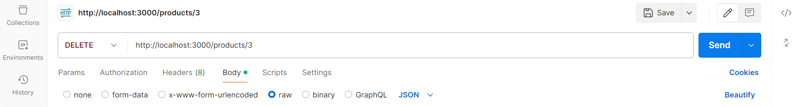

# Product API

A simple product API built with Node.js and Express that allows you to create, retrieve, update, delete, and sort products.

## Features
- **Create a product**: Add a new product with attributes like name, description, price, and quantity.
- **Retrieve products**: View all products or a single product by ID.
- **Update a product**: Modify the details of an existing product.
- **Delete a product**: Remove a product by ID.
- **Sort products**: Sort products by price or name.

## Setup and Installation
1. Clone the repository:
   ```bash
   git clone https://github.com/Srinidhi-Krishnan30/product-api
2. Navigate to the project directory:
    cd your-repo-name
3. Perform basic setup:
    npm init
    npm install express
4. Start the server
    node index.js

The server will start on http://localhost:3000.

### API Endpoints

| Method | Endpoint                   | Description                               |
|--------|-----------------------------|-------------------------------------------|
| GET    | `/products`                | Retrieve all products                     |
| GET    | `/products/:id`            | Retrieve a single product by ID           |
| POST   | `/products`                | Create a new product                      |
| PUT    | `/products/:id`            | Update an existing product by ID          |
| DELETE | `/products/:id`            | Delete a product by ID                    |
| GET    | `/products-sort?sortBy=price` | Sort products by price |


## Testing with Postman

### GET /products

##### This command retrieves all the products available in the database

### GET/products/id

#####This command retrieves a particular product based on id

### POST/products

##### This command adds a new product to the database

Sample Body Format:
```json
    {
    "Name": "Example Product",
    "Desc": "Example Description",
    "Price": 100,
    "Quantity": 10
}

### PUT /products/id

##### Modify the product details in place after matching based on id given in request

```json
Sample body format
{
    "Name": "Updated Product Name",
    "Desc": "Updated Product Description",
    "Price": 120,
    "Quantity": 5
}

### DELETE /products/

#### Removes product information based on id given in request


### GET /products-sort

##### Sorts all the elements in the database by price and returns the sorted array


